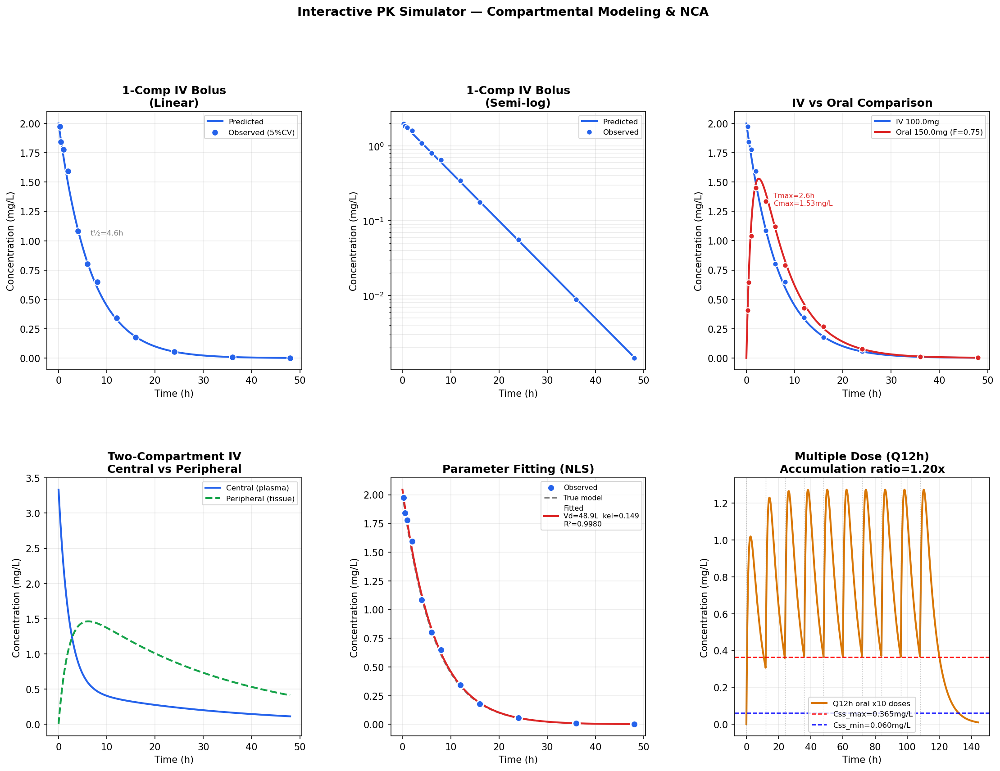

# PK Simulator
**Compartmental Modeling, NCA & Parameter Fitting in Python**

## Overview
Python-based pharmacokinetic simulator implementing one- and two-compartment 
models, non-compartmental analysis (NCA), parameter fitting, and multiple dose 
steady-state simulation. Built following FDA PBPK Modeling Workshop training (2024).

## Features
- One-compartment IV bolus and oral (first-order absorption)
- Two-compartment ODE system (central vs peripheral distribution)
- NCA: AUC (linear-log trapezoidal), Cmax, Tmax, t½, CL, Vd
- Non-linear least squares parameter fitting (scipy.optimize)
- Multiple dose simulation with steady-state Css prediction
- Interactive Plotly dashboard

## Results

## Tools
Python · numpy · scipy · pandas · matplotlib · plotly

## Author
Nadia Tasnim Ahmed, PhD  
Pharmaceutical Data Scientist | LC-MS · PBPK · CMC
